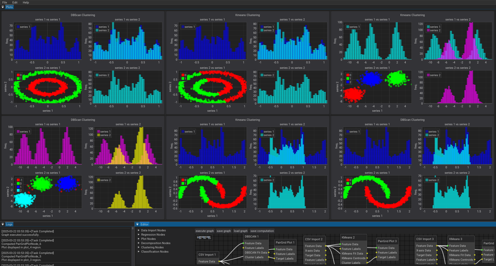

# XploreML: Accelerated ML Workflows


Welcome to **XploreML**, your fast-track solution for building and executing machine learning workflows with minimal effort. Our node-based application empowers you to construct, experiment, and deploy intelligent data pipelines that leverage state-of-the-art ML concepts.

---

> **⚠️ Warning:**
> This application is not production ready!

## Overview

**XploreML** uses an intuitive drag-and-drop interface where nodes represent key components of an ML pipeline:

- **Data Import & Preprocessing:** Ingest CSV data, perform feature extraction, and transform raw datasets into "clean" tensors ready for analysis.
- **Statistical Modeling & Machine Learning:** Utilize nodes for clustering, regression, and principal component analysis (PCA), among other methods, to discover patterns and predict outcomes.
- **Visualization:** Generate interactive plots, heat maps, and pair grids to visualize data distributions, and decision boundaries.

---

## Key Features

- **Node-Based Workflow Editor:**

  - **Rapid Prototyping:** Assemble ML models by connecting nodes representing data ingestion, preprocessing, model training, and visualization.
  - **Graph Execution:** Trigger end-to-end processing pipelines that apply techniques like regression, classification methods, and clustering algorithms.

- **Advanced Machine Learning Tools:**

  - **Clustering:** Deploy KMeans and other unsupervised learning algorithms to segment your data into meaningful clusters.
  - **Regression & Prediction:** Build nodes for linear regression and advanced predictive analytics to forecast trends.
  - **Dimensionality Reduction:** Use PCA nodes to reduce feature space and enhance model performance.

- **Customizable Visualizations:**

  - **Interactive Plots:** Experiment with various plot types to interpret model outcomes and compare prediction intervals.
  - **Material Dark Theme:** Enjoy an aesthetically pleasing UI that emphasizes clarity and focus during intensive data analysis sessions.

- **Streamlined Workflow Persistence:**

  - **Save & Load Pipelines:** Persist your ML workflow as a JSON graph and rehydrate it later for iterative enhancement or deployment.

- **Deploying Models:**

  - **Save Model:** Save ML models as pickel objects for deployment.

---

## Getting Started

### Prerequisites

Ensure you have the following dependencies installed:

- `dearpygui==2.0.0`
- `pandas>=2.2.3`
- `numpy>=2.2.3`
- `scikit-learn>=1.6.1`
- `sqlalchemy==2.0.38`

### Launching XploreML

Run the application via the main script:

```bash
python main_app.py
```

This launches the node editor so you can start assembling your AI pipelines immediately.

### User Interface

**XploreML** has three main windows on launch. Thus, Plots window for visualization, Logs window for events update, and the Editor for creating and editing nodes (see Figure below). Windows sizes and positions can be adjusted to suit needs.



### Examples

Pre-created pipelines can be loaded from the menu bar Help->Examples. Right clicking on nodes opens a dialog box with settings for that particular nodes.

### Building Your Workflow

1. **Add Nodes:**  
   Drag and drop nodes such as CSV Import, KMeans, and PCA onto the canvas.
2. **Connect & Configure:**  
   Link the output of the data import node to the input of your preprocessing or model nodes. Set parameters for algorithms like learning rates and clustering counts.
3. **Execute & Visualize:**  
   Run your pipeline, and view real-time plots and logs detailing model performance and analytic metrics.

---

## For Developers

**XploreML** can extended by implementing two mandatory classes and an optional class for plot nodes.

### Node Class

- This class contains the logic and data for nodes. All node classes inherit from the base class **Node**. Two abstract methods compute and pre_save needs implementation.
  - **compute method** is run for the node class during execution.
  - **pre_save method** is executed when saving computations.
- In summary, the node class contains the "business logic" of the node (see app/nodes for example implementation)"

### NodeUI Class

- This class implements how the node is displayed. All NodeUI classes inherit from **BaseNodeUI** class which handles drawing of the actual node.
- However, three methods require implementation. Thus, a **node_popup**, **node_popup_callback**, and **update_ui** (see app/ui folder for example implementation)
  - **node_popup** allow the user to customize the node for computation
  - **node_popup_callback** saves user customized data
  - **update_ui** update popup data when graph is loaded from disk.

### Registering Custom Nodes

Custom created nodes needs to be registered in the node_config.py in app/utils folder. Note that plot nodes needs to be added to the list of plot nodes in the same file. Additionally, custom plots needs to be registered in plots_config.py.

### Custom Plot Class

- Custom plots can be implemented as a class in the plot_area file. see app/ui/plot_area.py for example implementation.

## Advanced Concepts

**XploreML** embraces industry-standard ML terminology and best practices:

- **Feature Extraction & Engineering:** Transform raw data into robust feature sets.
- **Hyperparameter Tuning:** Adjust settings to optimize learning regimens.
- **Model Evaluation:** Visualize loss, accuracy, and validation metrics to fine-tune performance.
- **Data Pipelines:** Leverage modular nodes to encapsulate discrete computation stages, enabling reproducible and scalable data science workflows.

---

## Why XploreML?

**XploreML** is designed to reduce cognitive friction and computational overhead. By abstracting complex ML routines behind an intuitive node interface, you can experiment with various algorithms and rapidly iterate toward powerful, production-ready models.

Dive in, speed up your prototyping, and let **XploreML** be your companion on your journey through the ever-evolving world of machine learning!

---

Happy analyzing and modeling!
